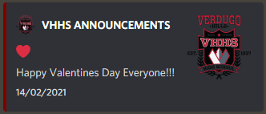

Intduction to webhooks
======================

Brief Intro
---------------------
Webhooks are a way to send embeds and such to discord. Since self-bots (directly accessing discord API from your own account) is prohibited, webhhooks provide the next best way to send items such as embeds. An embed looks like this:\
\
Inside of a webhook there are a couple things you should be aware of

Contents of a webhook
---------------------
(You can see the example JS file <a href='./webhooktemplate.md' target='_blank'>here</a>)
These are the main components of a webhook:
1. The author. The author in turn has additonal compositions:
   * The name. This is held in the `params.author` property
   * The profile picture. This is held in the `params.avatar_url` property
2. The content. This is stored in the `params.content` property. This **can** contain pings including @here and @everyone. These pings work.
3. Embeds. These are kept in an array in the `params.embeds` property. Embeds have large functional value (I will detail their inner items in a moment), however do note pings inside of embeds **will not** work. The following are the values held in an embed:
   * The author. Works the same as the properties for the general author in a webhook. Can be accessed in the `params.embeds[i].author.name` and the `params.embeds[i].author.icon_url` properties.
   * The time stamp. This can be predefined or defined in code. The easiest way to do this is by using the js command: 
   ```js 
    const timeStamp = new Date(new Date.getTime()).toISOString();
    ```
   * The footer. The footer consists of text and a picture. Accessed in `params.embeds[i].footer.text` and `params.embeds[i].footer.icon_url`, respectively. 
   * The Title. This is the big text at the top of an embed. Accessed in `params.embeds[i].title`.
   * The Url. If you click on the title it will take you to this link. Accessed in `params.embeds[i].url`.
   * The Description. The Smaller text below the title. Accessed in `params.embeds[i].description`.
   * Fields. Fields are stored in an array and can take multiple items. Each field holds up to three values
        1. The name (the-sub title for the field). Accessed in `params.embeds[i].fields[j].name`.
        2. The value (the description for the field). Accessed in `params.embeds[i].fields[j].value`.
        3. inline. Takes `true` or `false` values to discplay in a block. Accessed in `params.embeds[i].fields[j].inline`.
   * The colour. This designates the colour the embed will use along the left side. Takes a hex value preceeded by `0x` (or that value converted to decimal with no prefix). Accessed in `params.embeds[i].color`.
   * There are a few more areas that webhooks have, but this is about all the basics that need to be said. The announcement webhooks have a special html file that auto prepare and send the embeds for you as well.

Running the Webhook
-------------------
1. Follow the first step in [this tutorial](https://support.discord.com/hc/en-us/articles/228383668-Intro-to-Webhooks);
2. Replace the value of `webhookUrl` in the webhook file with the webhook link you copied;
3. Fill in all values that you need to change in the website;
4. In your **browser console** (note: node _**will not**_ work for this) copy and paste the JS code[^1];
5. Run the code!

[^1]: I personally reccoment Firefox Developer Edition for this, as it comes with a built-in multi line console, unlike most other broswers